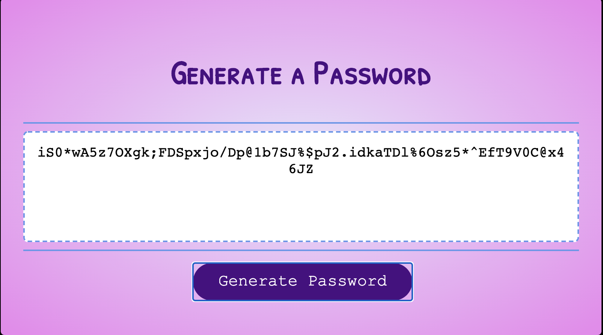

# Password Generator 
> It is important to increase your online security by not only using different passwords for each of your online accounts, but also keeping your passwords random and difficult to figure out. This application uses JavaScript to generate a random, automated password with criteria based on user input. The password generated can be from 8 to 128 characters long, and can include uppercase and lowercase letters, numbers, and special characters.

## General Info

This Password Generator first prompts the user to enter how many characters they would like their password to include. The application will not allow the user to input a number less than 8, a number greater than 128, a number including a decimal, or a character that isn't a number. If these conditions occur, the generator will notify the user about the problem with their input, and then re-prompt them to input their number of characters.

Once the user has input a valid number of characters (from 8 to 128) for their password length, the generator will ask the user if they want uppercase letters, lowercase letters, numbers, and special characters in their password. If the user clicks "OK" for a prompt, the character type mentioned in the prompt will be included in the password. If the user clicks "Cancel" for a prompt, the character type mentioned will not be included in the password. If the user clicks "Cancel" for all four of the possible character types, the generator will not be able to create a password and will alert the user they need to select one character type in order to create a password.

Once the user has confirmed all of the characters they want in their password, the generator will generate a random password based on the user's choices and write it to the page! 

## Screenshots

Page Layout

Prompt asking how long the user wants their password to be

Prompt asking whether the user wants a certain type of character in their password (in this case, lowercase letters)

Example of a randomly generated password

What will show if an invalid number of characters is input for the password length (in this case, less than 8 characters)

## Acknowledgements

Special thanks to everyone at UW Coding Bootcamp for demonstrating the application, showing me the pseudocode necessary to complete the assignment, giving tips in the Slack chat, and helping us all survive JavaScript!